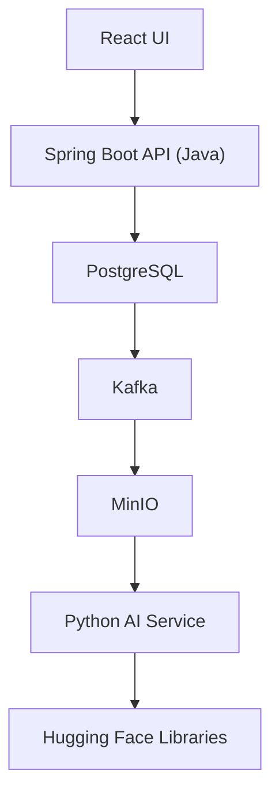
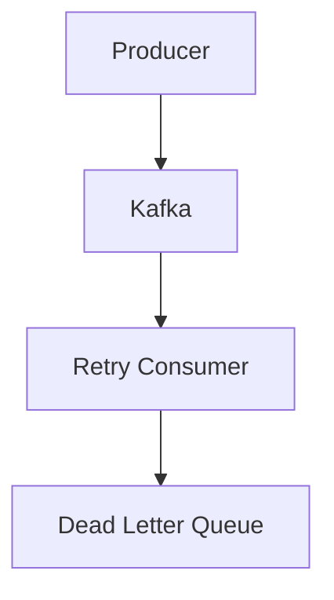
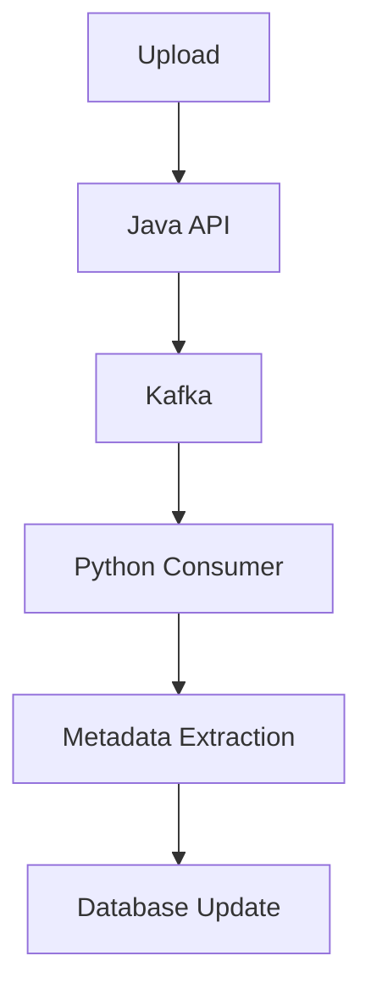
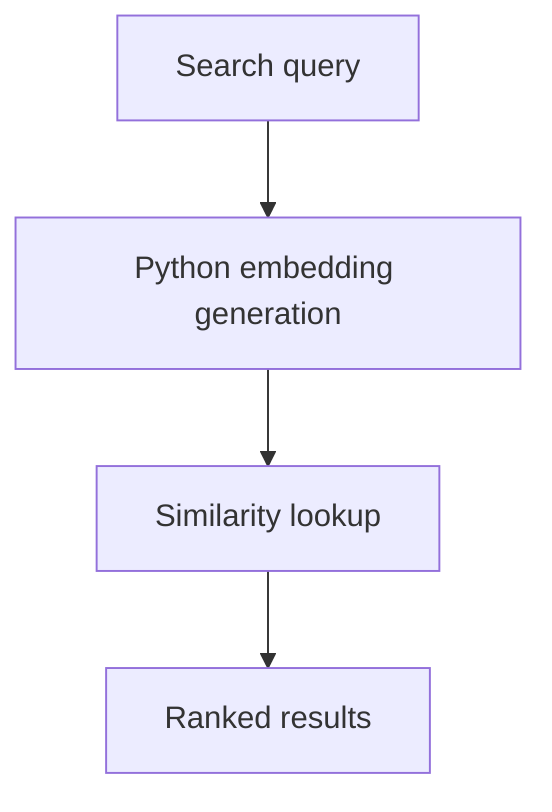

# Polyglot AI Model Hub Roadmap

- [Polyglot AI Model Hub Roadmap](#polyglot-ai-model-hub-roadmap)
  - [Goal](#goal)
    - [Build a portfolio project using both Java and Python that demonstrates:](#build-a-portfolio-project-using-both-java-and-python-that-demonstrates)
      - [Project Architecture](#project-architecture)
  - [Week 1: Producer Consumer Pattern](#week-1-producer-consumer-pattern)
    - [Learning - Week 1](#learning---week-1)
    - [Build - Week 1](#build---week-1)
    - [Acceptance Criteria - Week 1](#acceptance-criteria---week-1)
    - [Interview Topics - Week 1](#interview-topics---week-1)
  - [Week 2: Worker Pool](#week-2-worker-pool)
    - [Learning - Week 2](#learning---week-2)
    - [Build - Week 2](#build---week-2)
    - [Acceptance Criteria - Week 2](#acceptance-criteria---week-2)
  - [Week 3: Read Write Lock](#week-3-read-write-lock)
    - [Learning - Week 3](#learning---week-3)
    - [Build - Week 3](#build---week-3)
    - [Acceptance Criteria - Week 3](#acceptance-criteria---week-3)
  - [Week 4: Event Bus](#week-4-event-bus)
    - [Learning - Week 4](#learning---week-4)
    - [Build - Week 4](#build---week-4)
    - [Acceptance Criteria - Week 4](#acceptance-criteria---week-4)
  - [Week 5: Kafka Fundamentals](#week-5-kafka-fundamentals)
    - [Learning - Week 5](#learning---week-5)
    - [Setup - Week 5](#setup---week-5)
    - [Build - Week 5](#build---week-5)
    - [Acceptance Criteria - Week 5](#acceptance-criteria---week-5)
  - [Week 6: Kafka Reliability](#week-6-kafka-reliability)
    - [Learning - Week 6](#learning---week-6)
    - [Build - Week 6](#build---week-6)
    - [Acceptance Criteria - Week 6](#acceptance-criteria---week-6)
  - [Week 7: Model Hub Foundation](#week-7-model-hub-foundation)
    - [Learning - Week 7](#learning---week-7)
    - [Build - Week 7](#build---week-7)
      - [model-hub](#model-hub)
    - [Acceptance Criteria - Week 7](#acceptance-criteria---week-7)
  - [Week 8: Model Storage](#week-8-model-storage)
    - [Learning - Week 8](#learning---week-8)
    - [Build - Week 8](#build---week-8)
    - [Acceptance Criteria - Week 8](#acceptance-criteria---week-8)
  - [Week 9: Python Metadata Service](#week-9-python-metadata-service)
    - [Learning - Week 9](#learning---week-9)
    - [Build - Week 9](#build---week-9)
      - [metadata-service](#metadata-service)
    - [Acceptance Criteria - Week 9](#acceptance-criteria---week-9)
  - [Week 10: Kafka Between Java and Python](#week-10-kafka-between-java-and-python)
    - [Learning - Week 10](#learning---week-10)
    - [Build - Week 10](#build---week-10)
    - [Acceptance Criteria - Week 10](#acceptance-criteria---week-10)
  - [Week 11: Search](#week-11-search)
    - [Learning - Week 11](#learning---week-11)
      - [PostgreSQL Full Text Search](#postgresql-full-text-search)
    - [Build - Week 11](#build---week-11)
    - [Acceptance Criteria - Week 11](#acceptance-criteria---week-11)
  - [Week 12: Authentication](#week-12-authentication)
    - [Learning - Week 12](#learning---week-12)
    - [Build - Week 12](#build---week-12)
      - [Authentication system.](#authentication-system)
    - [Acceptance Criteria - Week 12](#acceptance-criteria---week-12)
  - [Week 13: Python AI Features](#week-13-python-ai-features)
    - [Learning - Week 13](#learning---week-13)
    - [Build - Week 13](#build---week-13)
      - [Embedding generation service.](#embedding-generation-service)
    - [Acceptance Criteria - Week 13](#acceptance-criteria---week-13)
  - [Week 14: Semantic Search](#week-14-semantic-search)
    - [Learning - Week 14](#learning---week-14)
    - [Build - Week 14](#build---week-14)
      - [Semantic search capability.](#semantic-search-capability)
    - [Acceptance Criteria - Week 14](#acceptance-criteria---week-14)
  - [Week 15: Kubernetes](#week-15-kubernetes)
    - [Learning - Week 15](#learning---week-15)
    - [Build - Week 15](#build---week-15)
    - [Acceptance Criteria - Week 15](#acceptance-criteria---week-15)
  - [Week 16: Terraform](#week-16-terraform)
    - [Learning - Week 16](#learning---week-16)
    - [Build - Week 16](#build---week-16)
      - [Provision infrastructure.](#provision-infrastructure)
    - [Acceptance Criteria - Week 16](#acceptance-criteria---week-16)
  - [Week 17: CI/CD](#week-17-cicd)
    - [Learning - Week 17](#learning---week-17)
    - [Build - Week 17](#build---week-17)
    - [Acceptance Criteria - Week 17](#acceptance-criteria---week-17)
  - [Week 18: Portfolio Finish](#week-18-portfolio-finish)
    - [Documentation - Week 18](#documentation---week-18)
    - [Acceptance Criteria - Week 18](#acceptance-criteria---week-18)
  - [Final Resume Bullet](#final-resume-bullet)
  - [Success Criteria for the Entire Project](#success-criteria-for-the-entire-project)
    - [Technical](#technical)
    - [Portfolio](#portfolio)

## Goal

### Build a portfolio project using both Java and Python that demonstrates:

- Java
- Python
- Spring Boot
- FastAPI
- Kafka
- PostgreSQL
- Docker
- Kubernetes
- Terraform
- GitHub Actions
- Distributed Systems
- Event-Driven Architecture
- AI/LLM Fundamentals

#### Project Architecture



The goal is to be able to say:

```plaintext
"Designed and implemented a polyglot AI platform using Java, Python, Kafka,
PostgreSQL, MinIO, Kubernetes, Terraform, and GitHub Actions."
```

---

## Week 1: Producer Consumer Pattern

### Learning - Week 1

> - Thread lifecycle
> - ExecutorService
> - BlockingQueue
> - Producer/Consumer pattern
> - Race conditions

### Build - Week 1

Implement:

> - Producer
> - Consumer
> - BlockingQueue
> - Task

without using Kafka.

### Acceptance Criteria - Week 1

[ ] Start 3 producers
[ ] Start 5 consumers
[ ] Process 10,000 tasks
[ ] No task loss
[ ] No duplicate processing
[ ] JUnit coverage greater than 70%
[ ] README explains race conditions

### Interview Topics - Week 1

> - Thread safety
> - Backpressure
> - Producer/Consumer

---

## Week 2: Worker Pool

### Learning - Week 2

> - Fixed thread pools
> - Cached thread pools
> - Futures
> - CompletableFuture

### Build - Week 2

Implement:

> - WorkerPool
> - TaskExecutor

Features:

> - Submit task
> - Queue task
> - Execute task
> - Return result

### Acceptance Criteria - Week 2

[ ] Submit 1,000 tasks
[ ] Execute tasks concurrently
[ ] Configurable worker count
[ ] Task failures handled
[ ] Graceful shutdown
[ ] Metrics reported

Example:

```plaintext
Tasks completed: 1000
Tasks failed: 12
Average latency: 22ms
```

---

## Week 3: Read Write Lock

### Learning - Week 3

> - Critical sections
> - Fairness
> - Reader starvation
> - Writer starvation

### Build - Week 3

Implement custom ReadWriteLock.

Do not use the built-in Java implementation initially.

### Acceptance Criteria - Week 3

[ ] Support 100 readers
[ ] Support 10 writers
[ ] Data remains consistent
[ ] No deadlock
[ ] Unit tests verify correctness
[ ] Documentation explains starvation risks

---

## Week 4: Event Bus

### Learning - Week 4

> - Observer Pattern
> - Publish/Subscribe
> - Event-driven architecture

### Build - Week 4

Implement:

> - EventBus
> - Publisher
> - Subscriber

Example Events:

```plaintext
- UserRegisteredEvent
```

Subscribers:

> - AuditService
> - AnalyticsService
> - EmailService

### Acceptance Criteria - Week 4

[ ] Event published successfully
[ ] Three independent subscribers
[ ] Failed subscriber does not stop others
[ ] Event processing metrics recorded

---

## Week 5: Kafka Fundamentals

### Learning - Week 5

> - Topics
> - Partitions
> - Offsets
> - Consumer Groups
> - At-Least-Once Delivery

### Setup - Week 5

Docker Compose:

> - Kafka
> - Kafka UI

### Build - Week 5

> - ModelUploadProducer
> - ModelUploadConsumer

### Acceptance Criteria - Week 5

[ ] Kafka running locally
[ ] Topic created
[ ] Produce 1,000 messages
[ ] Consume all messages
[ ] Verify ordering
[ ] Understand offsets and lag

---

## Week 6: Kafka Reliability

### Learning - Week 6

> - Retries
> - Dead Letter Queues
> - Idempotency
> - Rebalancing

### Build - Week 6

Pipeline:



### Acceptance Criteria - Week 6

[ ] Retry mechanism implemented
[ ] Dead Letter Queue implemented
[ ] Idempotent consumer implemented
[ ] Simulate consumer failures
[ ] Validate recovery process

Example:

```plaintext
20 bad messages
17 recovered
3 sent to DLQ
```

---

## Week 7: Model Hub Foundation

### Learning - Week 7

> - Spring Boot architecture
> - Hexagonal architecture
> - REST API design

### Build - Week 7

Project:

#### model-hub

Technology:

> - Spring Boot
> - PostgreSQL
> - Flyway

Entities:

> - User
> - Model
> - Version

### Acceptance Criteria - Week 7

[ ] CRUD API for models
[ ] PostgreSQL schema created
[ ] Flyway migrations working
[ ] Integration tests pass
[ ] OpenAPI documentation generated

---

## Week 8: Model Storage

### Learning - Week 8

> - Object storage
> - Multipart uploads
> - MinIO basics

### Build - Week 8

Store model files in MinIO.

### Acceptance Criteria - Week 8

[ ] Upload file
[ ] Download file
[ ] Store metadata in PostgreSQL
[ ] Store content in MinIO
[ ] Support files larger than 100 MB
[ ] Docker Compose environment working

---

## Week 9: Python Metadata Service

### Learning - Week 9

> - FastAPI
> - Python packaging
> - Service-to-service communication

### Build - Week 9

#### metadata-service

Responsibilities:

> - Calculate checksum
> - Determine file type
> - Determine file size

### Acceptance Criteria - Week 9

[ ] FastAPI running
[ ] Java calls Python API
[ ] Metadata returned successfully
[ ] Dockerized
[ ] Health endpoint implemented

---

## Week 10: Kafka Between Java and Python

### Learning - Week 10

> - Event-driven microservices

### Build - Week 10



### Acceptance Criteria - Week 10

[ ] Upload publishes event
[ ] Python consumes event
[ ] Metadata generated
[ ] Metadata stored
[ ] Event tracing documented

---

## Week 11: Search

### Learning - Week 11

#### PostgreSQL Full Text Search

### Build - Week 11

Search APIs.

### Acceptance Criteria - Week 11

[ ] Search by name
[ ] Search by owner
[ ] Search by tags
[ ] Search response under 500 ms
[ ] Pagination implemented

---

## Week 12: Authentication

### Learning - Week 12

> - JWT
> - Spring Security

### Build - Week 12

#### Authentication system.

### Acceptance Criteria - Week 12

[ ] User registration
[ ] Login
[ ] JWT generation
[ ] JWT validation
[ ] Protected endpoints
[ ] ADMIN and USER roles

---

## Week 13: Python AI Features

### Learning - Week 13

Python libraries:

> - sentence-transformers
> - transformers

### Build - Week 13

#### Embedding generation service.

### Acceptance Criteria - Week 13

[ ] Generate embeddings
[ ] Persist embeddings
[ ] API endpoint created
[ ] Similarity comparison working

```plaintext
Example:

llama

similar to

llama-2
```

---

## Week 14: Semantic Search

### Learning - Week 14

> - Vector similarity
> - Embeddings

### Build - Week 14

#### Semantic search capability.



### Acceptance Criteria - Week 14

[ ] Query embedding generated
[ ] Similarity calculation works
[ ] Top N results returned
[ ] Search quality documented

---

## Week 15: Kubernetes

### Learning - Week 15

> - Pods
> - Deployments
> - Services
> - ConfigMaps
> - Secrets

### Build - Week 15

Deploy:

> - Java API
> - Python Service
> - PostgreSQL
> - Kafka
> - MinIO

### Acceptance Criteria - Week 15

[ ] All services running in Kubernetes
[ ] Services communicate successfully
[ ] Health endpoints accessible
[ ] Secrets stored correctly

---

## Week 16: Terraform

### Learning - Week 16

> - Infrastructure as Code
> - Terraform modules
> - Remote state

### Build - Week 16

#### Provision infrastructure.

### Acceptance Criteria - Week 16

[ ] Infrastructure defined in code
[ ] terraform plan succeeds
[ ] terraform apply succeeds
[ ] Variables documented
[ ] Outputs documented

---

## Week 17: CI/CD

### Learning - Week 17

> - GitHub Actions
> - Docker build pipelines

### Build - Week 17

Pipeline stages:

> - Build
> - Test
> - Package
> - Docker Build

### Acceptance Criteria - Week 17

[ ] Java tests run automatically
[ ] Python tests run automatically
[ ] Docker images built
[ ] Pull requests validated
[ ] Main branch protected

---

## Week 18: Portfolio Finish

### Documentation - Week 18

Create:

> - README
> - Architecture Diagram
> - Sequence Diagram
> - Deployment Guide
> - API Reference

Add:

> - Spring Actuator
> - Basic monitoring

### Acceptance Criteria - Week 18

[ ] Complete README
[ ] Architecture diagram
[ ] Sequence diagrams
[ ] Deployment instructions
[ ] API documentation
[ ] Resume bullet completed

---

## Final Resume Bullet

Designed and implemented a polyglot AI Model Hub using:

- Java (Spring Boot)
- Python (FastAPI)
- Kafka-based event processing
- PostgreSQL
- MinIO object storage
- semantic search
- Docker
- Kubernetes
- Terraform
- GitHub Actions CI/CD

Built distributed services communicating through synchronous REST APIs and asynchronous Kafka events while applying concurrency patterns, cloud-native deployment practices, and AI-powered search capabilities.

---

## Success Criteria for the Entire Project

### Technical

[ ] Java Spring Boot API deployed
[ ] Python FastAPI service deployed
[ ] Kafka event processing working
[ ] PostgreSQL persistent storage working
[ ] MinIO object storage working
[ ] Semantic search operational
[ ] Kubernetes deployment operational
[ ] Terraform provisioning operational
[ ] GitHub Actions CI/CD operational

### Portfolio

[ ] Public GitHub repository
[ ] Architecture diagrams
