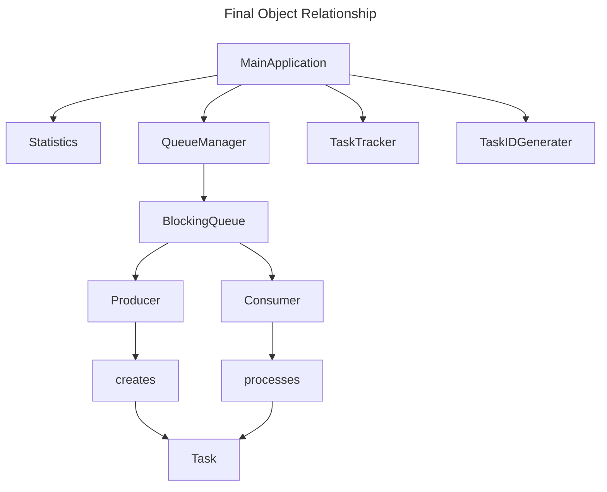

# week1-producer-consumer

- [week1-producer-consumer](#week1-producer-consumer)
  - [Initial Object Relationship Flow](#initial-object-relationship-flow)
  - [Classes](#classes)
    - [Class 1: Task](#class-1-task)
      - [Purpose - Represents one unit of work](#purpose---represents-one-unit-of-work)
      - [State - Task](#state---task)
      - [Behavior - Tasks should be mostly data](#behavior---tasks-should-be-mostly-data)
      - [Pseudocode - Task](#pseudocode---task)
    - [Class 2: TaskIDGenerator](#class-2-taskidgenerator)
      - [Purpose Guarantee unique IDs](#purpose-guarantee-unique-ids)
      - [Responsibilities - TaskIDGenerator](#responsibilities---taskidgenerator)
      - [Pseudocode - TaskIDGenerator](#pseudocode---taskidgenerator)
    - [Class 3: Statistics](#class-3-statistics)
      - [State - Statistics](#state---statistics)
      - [Responsibilities - Statistics](#responsibilities---statistics)
      - [Pseudocode - Statistics](#pseudocode---statistics)
    - [Class 4: TaskTracker](#class-4-tasktracker)
      - [Purpose - Verify no duplicate processing](#purpose---verify-no-duplicate-processing)
      - [State - TaskTracker](#state---tasktracker)
      - [Responsibilities - TaskTracker](#responsibilities---tasktracker)
      - [Pseudocode - TaskTracker](#pseudocode---tasktracker)
    - [Class 5: QueueManager](#class-5-queuemanager)
      - [Purpose - Hide queue implementation details](#purpose---hide-queue-implementation-details)
      - [Responsibilities - QueueManager](#responsibilities---queuemanager)
      - [Pseudocode - QueueManager](#pseudocode---queuemanager)
    - [Class 5: Producer](#class-5-producer)
      - [Purpose - Create tasks](#purpose---create-tasks)
      - [Dependencies - Producer](#dependencies---producer)
      - [Workflow - Producer](#workflow---producer)
      - [Pseudocode - Producer](#pseudocode---producer)
    - [Class 7: Consumer](#class-7-consumer)
      - [Purpose - process work from queue](#purpose---process-work-from-queue)
      - [Dependencies - Consumer](#dependencies---consumer)
      - [Workflow - Consumer](#workflow---consumer)
      - [Pseudocode - Consumer](#pseudocode---consumer)
    - [Class 8: ShutdownTask](#class-8-shutdowntask)
      - [Purpose - tell  consumers](#purpose---tell--consumers)
      - [Example Concept](#example-concept)
      - [Consumer Reaction](#consumer-reaction)
    - [Class: MainApplication](#class-mainapplication)
      - [Step 1 - Create Infrastructure](#step-1---create-infrastructure)
      - [Step 2 - Create Thread Pools](#step-2---create-thread-pools)
      - [Step 3 - Create objects](#step-3---create-objects)
      - [Step 4 - Submit to ExecutorService](#step-4---submit-to-executorservice)
      - [Step 5 - Wait for Producers to Finish](#step-5---wait-for-producers-to-finish)
      - [Step 6 - Submit Shutdown Signals](#step-6---submit-shutdown-signals)
      - [Step 7 - Wait for Consumers to Finish](#step-7---wait-for-consumers-to-finish)
      - [Step 8 - Validate acceptance criteria](#step-8---validate-acceptance-criteria)

├── MainApplication
├── Task
├── Producer
├── Consumer
├── TaskTracker
├── TaskIdGenerator
├── QueueManager
└── Statistics

---

## Initial Object Relationship Flow



---

## Classes

### Class 1: Task

#### Purpose - Represents one unit of work

#### State - Task

```plaintext
Task

    taskId

    payload

    createTimestamp
```

#### Behavior - Tasks should be mostly data

```plaintext
Provide tasks information
```

---

#### Pseudocode - Task

```plaintext
CLASS Task

    STORE id

    STORE payload

    STORE creation time

END CLASS
```

---

### Class 2: TaskIDGenerator

#### Purpose Guarantee unique IDs

#### Responsibilities - TaskIDGenerator

```plaintext
Generate next task id

Stop after 10,000
```

---

#### Pseudocode - TaskIDGenerator

```plaintext
CLASS TaskIDGenerator
    STORE nextId

    METHOD getNextId

        atomically increment value

        RETURN value

    END METHOD

END CLASS

Producer should create tasks.
Generator should generate IDs.
```

---

### Class 3: Statistics

#### State - Statistics

```plaintext

tasksProduced

tasksConsumed

duplicatesDetected
```

#### Responsibilities - Statistics

```plaintext
Increment counters safely
Provide final report
```

#### Pseudocode - Statistics

```plaintext
CLASS statistics

    STORE produced count

    STORE consumed count

    STORE duplicate count

    METHOD recordProduced

    METHOD recordConsumed

    METHOD recordDuplicate

END CLASS
```

---

### Class 4: TaskTracker

#### Purpose - Verify no duplicate processing

#### State - TaskTracker

```plaintext
Collection of processed task IDs
```

#### Responsibilities - TaskTracker

```plaintext
When consumer finishes:

    Was this task already processed?

        Yes -> Duplicate
        No -> record id
```

#### Pseudocode - TaskTracker

```plainttext
CLASS TaskTracker

    STORE processedIds

    METHOD markProcessed

        IF id already exists

            RETURN duplicate

        ELSE

            save id
            RETURN success

        END IF

    END METHOD

END CLASS
```

---

### Class 5: QueueManager

#### Purpose - Hide queue implementation details

Instead of:

```plaintext
Producer directly talks to queue
```

use:

```plaintext
Producer -> QueueManager

Consumer -> QueueManager
```

#### Responsibilities - QueueManager

```plaintext
Add task

Remove task

Expose queue size
```

#### Pseudocode - QueueManager

```plaintext
CLASS QueueManager

    STORE blocking queue

    METHOD submitTask

        place task into queue

    END METHOD

    METHOD getTask

        remove task from queue

    END METHOD

END CLASS
```

---

### Class 5: Producer

#### Purpose - Create tasks

#### Dependencies - Producer

```plaintext
TaskIdGenerator

QueueManager

Statistics
```

#### Workflow - Producer

```plaintext
Ask for next ID

Create task

Put task in queue

Record metric

Repeat
```

#### Pseudocode - Producer

```plaintext
CLASS Producer

    LOOP

        id = get next id

        IF id exceeds 10000
            stop

        CREATE task

        submit task to queue

        record production

    END LOOP

END CLASS
```

---

### Class 7: Consumer

#### Purpose - process work from queue

#### Dependencies - Consumer

```plaintext

QueueManger

TaskTracker

Statistics
```

#### Workflow - Consumer

```plaintext
Take task

Process task

Record completion

Track processed ID
```

#### Pseudocode - Consumer

```plaintext
CLASS Consumer

    LOOP forever

        task = get from queue

        IF shutdown task
            exit

        process task

        record completion

        track task id

    END LOOP

END CLASS
```

---

### Class 8: ShutdownTask

#### Purpose - tell  consumers

```plaintext
No more work exists
```

#### Example Concept

```plaintext
Normal Task
    id = 25

Shutdown Task
    id = SHUTDOWN
```

#### Consumer Reaction

```plaintext
IF task is shutdown

    exit loop

ELSE

    process normally
```

---

### Class: MainApplication

Orchestrator class

#### Step 1 - Create Infrastructure

```plaintext
Create TaskIdGenerator

Create Statistics

Create TaskTracker

Create QueueManger
```

#### Step 2 - Create Thread Pools

Roadmap requirements:

- 3 producers
- 5 consumers

#### Step 3 - Create objects

- create 3 producer instances
- create 5 consumer instances

#### Step 4 - Submit to ExecutorService

- Producer Pool
- Consumer Pool

#### Step 5 - Wait for Producers to Finish

- All producer threads complete

#### Step 6 - Submit Shutdown Signals

- One poison pill per consumer
- 5 consumers
- => 5 poison pills

#### Step 7 - Wait for Consumers to Finish

- Consumer threads exits

#### Step 8 - Validate acceptance criteria

- Produced = 10000
- Consumed = 10000
- Duplicates = 0
- Processed IDs = 10000
